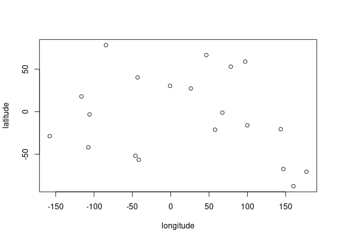
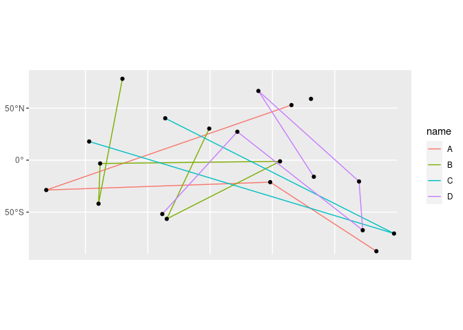
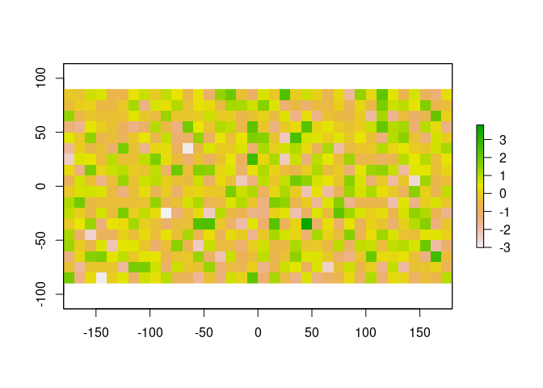
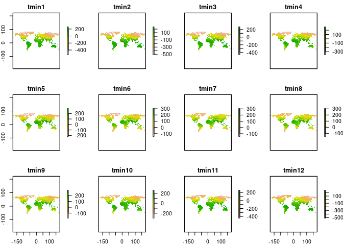
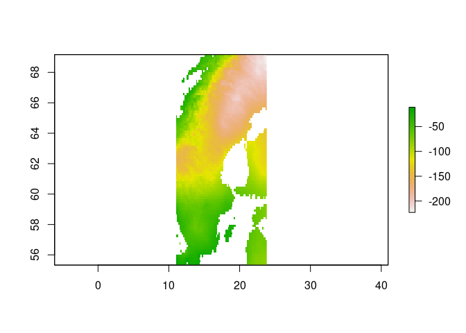
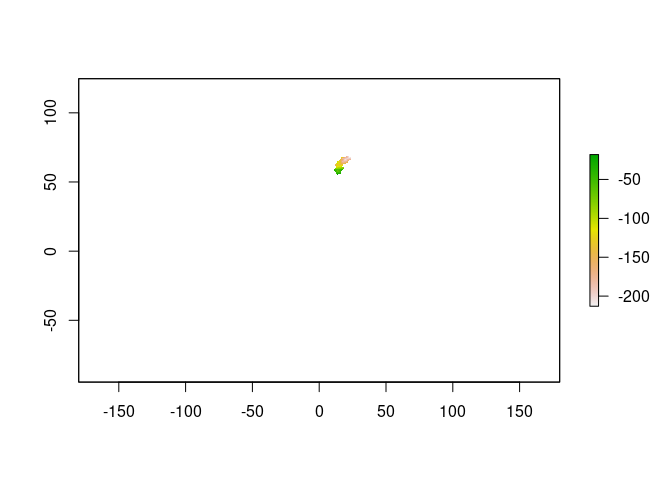

Spatial data in R
================
Christian König & Damaris Zurell

**This practical exercise is a part of the workshop [Big Data
Ecology](https://github.com/ChrKoenig/Big_Data_Ecology)**

------------------------------------------------------------------------

## Introduction

Here, we focus on spatial data, a central data type in ecology.
Following the content of the lecture, we will work with vector and
raster data and perform a number of operations based on their
attributes, geometries and spatial relationships.

We will use the following packages:

``` r
library(sf)
library(raster)
library(rnaturalearth)
library(dplyr)
library(ggplot2)
```

If you haven’t installed them, please do so with the following command:

``` r
install.packages(c("sf", "raster", "rnaturalearth", "dplyr", "ggplot2"))
```

## Vector data

Vector data typically represent discrete objects with clear boundaries
such as, e.g., individual trees, roads, or countries. In addition to
their spatial definition (geometry), vector data may carry ancillary
data on the spatial features, e.g. the species of the tree, the type of
the road, or name of the country. These additional information are
called attributes.

### Vector data types

There are three fundamental types of vector data:

-   **Points** occur at discrete locations and are represented by a
    coordinate pair (x,y).
-   **Lines** describe linear features and are defined by at least two
    coordinate pairs (x,y), the end points of the line. A line can also
    consist of several line segments.
-   **Polygons** describe two-dimensional features in the landscapes and
    define a bounded area, enclosed by lines. Thus, a polygon needs to
    consist of at least three coordinate pairs (x,y).

The `sf` package provides a set of vector data classes and methods
(*simple features*) that follow the *tidy* data model we already met
with the `dplyr` package. In fact, the *simple feature* standard is
language-independent and has been [adopted by many geospatial analysis
and database
platforms](https://en.wikipedia.org/wiki/Simple_Features#Implementations).
You can think of a *simple feature* as a normal data frame where each
row corresponds to one spatial entity, with the coordinates/geometries
of these entities being stored in a special column. Additional
attributes can be simply added as new columns. This design enables the
use of tidy data manipulation tools for *simple features* without
breaking the link between the attribute and geometry data.

### Point features

Let’s create a set of 20 points with random longitude and latitude
values:

``` r
set.seed(1)
coords = data.frame(
  longitude = runif(n = 20, min = -180, max = 180),
  latitude = runif(n = 20, min = -90, max = 90)
)
plot(coords)
```

<!-- -->

Now we use the `sf`package to convert this coordinate data frame into a
collection of simple point features.

``` r
points_sf = sf::st_as_sf(coords, coords = c("longitude", "latitude"), crs = 4326)  
points_sf
```

    ## Simple feature collection with 20 features and 0 fields
    ## geometry type:  POINT
    ## dimension:      XY
    ## bbox:           xmin: -157.7569 ymin: -87.58974 xmax: 177.0862 ymax: 78.24694
    ## geographic CRS: WGS 84
    ## First 10 features:
    ##                       geometry
    ## 1   POINT (-84.41688 78.24694)
    ## 2   POINT (-46.0354 -51.81435)
    ## 3    POINT (26.22721 27.30128)
    ## 4   POINT (146.9548 -67.40008)
    ## 5  POINT (-107.3945 -41.90028)
    ## 6   POINT (143.4203 -20.49946)
    ## 7   POINT (160.0831 -87.58974)
    ## 8   POINT (57.88721 -21.17017)
    ## 9    POINT (46.48106 66.54435)
    ## 10 POINT (-157.7569 -28.73718)

The `print` method outputs an informative summary of our new `sf`
object: It’s a simple feature collection of 20 point features. These
point features are defined in two dimensions (XY) and have no additional
attributes. Also note that the EPSG code provided to the `CRS` argument
of the `st_as_sf()` function is sufficient to fully define the
coordinate reference system (CRS) of our spatial object.

Next, we use the very same manipulation tools as for other tidy data to
add an *attribute* column to `points_sf`. Specifically, we use the
`mutate()` verb known from `dplyr` for this task:

``` r
points_sf = points_sf %>% 
  mutate(name = sample(LETTERS[1:5], 20, replace = T)) # Add random letters as new attribute 'name'
points_sf
```

    ## Simple feature collection with 20 features and 1 field
    ## geometry type:  POINT
    ## dimension:      XY
    ## bbox:           xmin: -157.7569 ymin: -87.58974 xmax: 177.0862 ymax: 78.24694
    ## geographic CRS: WGS 84
    ## First 10 features:
    ##                       geometry name
    ## 1   POINT (-84.41688 78.24694)    B
    ## 2   POINT (-46.0354 -51.81435)    D
    ## 3    POINT (26.22721 27.30128)    D
    ## 4   POINT (146.9548 -67.40008)    D
    ## 5  POINT (-107.3945 -41.90028)    B
    ## 6   POINT (143.4203 -20.49946)    D
    ## 7   POINT (160.0831 -87.58974)    A
    ## 8   POINT (57.88721 -21.17017)    A
    ## 9    POINT (46.48106 66.54435)    D
    ## 10 POINT (-157.7569 -28.73718)    A

### Line and Polygon features

The structure of simple line and polygon features is analogous to simple
point features, the only difference being that the geometry column now
holds multiple coordinates to define the shape of the features. We’ll
confirm this by aggregating `points_sf` to one line feature per name.

``` r
lines_sf = points_sf %>% 
  group_by(name) %>%     # group by name
  filter(n() > 1) %>%    # lines need more than 1 point
  summarise(do_union = F) %>%  # Don't union geometries
  sf::st_cast("LINESTRING")  # Create one line feature per group
lines_sf
```

    ## Simple feature collection with 4 features and 1 field
    ## geometry type:  LINESTRING
    ## dimension:      XY
    ## bbox:           xmin: -157.7569 ymin: -87.58974 xmax: 177.0862 ymax: 78.24694
    ## geographic CRS: WGS 84
    ## # A tibble: 4 x 2
    ##   name                                                                  geometry
    ##   <chr>                                                         <LINESTRING [°]>
    ## 1 A     (160.0831 -87.58974, 57.88721 -21.17017, -157.7569 -28.73718, 78.34266 …
    ## 2 B     (-84.41688 78.24694, -107.3945 -41.90028, -105.8492 -3.225579, 67.32822…
    ## 3 C                 (-116.4396 17.92185, 177.0862 -70.57015, -43.18734 40.26797)
    ## 4 D     (-46.0354 -51.81435, 26.22721 27.30128, 146.9548 -67.40008, 143.4203 -2…

Finally, let’s plot our spatial objects. The `sf` package implements a
custom geom class that works with the `ggplot2` package:

``` r
ggplot() +
  geom_sf(data = lines_sf, aes(color = name)) + # Plot lines, color by group
  geom_sf(data = points_sf)   # Plot points in standard black
```

<!-- -->

## Raster data

Raster data are used to represent grids of values across a continuous
area, e.g. a digital elevation model, NDVI satellite measurements, or
interpolated climate variables. We will use the `raster` package to
represent and analyse raster data in `R`. The package contains different
data classes, most importantly `RasterLayer`, `RasterStack` and
`RasterBrick`. `RasterLayers` contain only a single layer of values
while `RasterStacks` and `RasterBricks` contain multiple layers (from
separate files or from a single multi-layer file, respectively).

### RasterLayers, RasterStacks and RasterBricks

The function `raster()` can be used to create `RasterLayer` objects.
We’ll create a continuous global grid of 10x10-degree raster cells. For
illustration purposes, we set the CRS with a proj4 string this time.

``` r
r1 = raster::raster(ncol=36, nrow=18, xmx=180, xmn=-180, ymx=90,  ymn=-90)
raster::crs(r1) = "+proj=longlat +datum=WGS84 +no_defs" # set CRS with Proj4 string
r1
```

    ## class      : RasterLayer 
    ## dimensions : 18, 36, 648  (nrow, ncol, ncell)
    ## resolution : 10, 10  (x, y)
    ## extent     : -180, 180, -90, 90  (xmin, xmax, ymin, ymax)
    ## crs        : +proj=longlat +datum=WGS84 +no_defs

`RasterLayers` can only possess one attribute/value per cell. We use the
`values()` function to access the attributes of our empty raster object
and assign some random values.

``` r
values(r1) = rnorm(ncell(r1)) # assign random values
plot(r1)   # plot raster
```

<!-- -->

`RasterStack` and `RasterBrick` objects can be created with the
`stack()` and `brick()` function, respectively. Note that this only
works when all rasters have the same spatial extent and resolution.

``` r
r2 = r1 # Copy r1 into new object

raster::stack(r1,r2) # Create RasterStack 
raster::brick(r1,r2) # Create RasterBrick
```

### Importing and downloading data

The `raster()`, `stack()`, and `brick()` functions can not only be used
for creating `Raster*` objects from scratch, but also for reading raster
files from disk. To do this, simply provide one or multiple file paths
instead of the names of the `R` objects as function arguments.

Additionally, the `raster` package offers the interesting feature of
downloading data directly from a number of standard repositories with
the `getData()` function. For more information, see the help pages with
`?getData`.

``` r
# Download RasterStack of global monthly minimum temperatures (°C*10) from WorldClim
tmin = raster::getData("worldclim", var="tmin", res=10, download = T, path = "../data/")
plot(tmin)
```

<!-- -->

## Manipulating vector and raster data

In the following section, we will look at some common operations on
spatial data.

### Attribute operations

As we’ve seen above, we can manipulate the attribute data of `sf`
objects in the same way as non-spatial tidy data by using
`dplyr`-syntax, e.g. the `filter()`, `mutate()`, `select()`,
`summarise()`, and `arrange()` functions. The special geometry column of
`sf` objects is *sticky* throughout attribute data operations, i.e. it
is always added back to the result. If we want to explicitly remove the
spatial context of the data, e.g. to speed up computations, we can use
the `st_drop_geometry()` function and convert our `sf` object to an
ordinary `data.frame`.

``` r
points_sf %>% 
  sf::st_drop_geometry() %>% 
  class()
```

    ## [1] "data.frame"

Attribute data of raster objects behave similar (but not identical!) to
matrices in `R`. We can do arithmetic operations (addition, subtraction,
multiplication, division), produce layer-wise summaries with the
`cellStats()` function, or calculate cell-wise summaries with the
standard `min()`, `max()`, or `mean()` functions. Both single- and
multi-layer `rasters` can be subset using familiar `[]`-syntax\`.

``` r
r1 + r1              # Arithmetic
raster::cellStats(r1, min)   # Minimum value per layer
r1_stack = min(stack(r1, r1/2)) # Minimum value per cell 
r1_stack[[1]]        # Subset by layer index
r1[7,13]             # Subset by row/column index
```

### Spatial data and geometry operations

Instead of their attributes, we can also use the shape and location of
spatial objects to modify either their attribute data (spatial data
operations) or their geometries (geometry operations). A complete
coverage of all spatial operations is far beyond the scope of this
workshop, so we’ll just have a look at a few examples.

First, we’ll spatially join country-level information to our `points_sf`
layer based on the points’ coordinates, i.e. in which country they fall.
We use the `ne_countries()` function from the `rnaturalearth` package to
download a *simple feature* polygon layer containing a number of
country-level attribute data, and then use the `st_join()` function to
merge the country name to our point layer:

``` r
world_sf = rnaturalearth::ne_countries(returnclass = "sf") # Download country layer using rnaturalearth package
st_join(points_sf, world_sf) %>%            # Join data based on location, not attribute columns
  dplyr::select(point_name = name.x, country_name = name.y) # select and rename results columns
```

    ## although coordinates are longitude/latitude, st_intersects assumes that they are planar
    ## although coordinates are longitude/latitude, st_intersects assumes that they are planar

    ## Simple feature collection with 20 features and 2 fields
    ## geometry type:  POINT
    ## dimension:      XY
    ## bbox:           xmin: -157.7569 ymin: -87.58974 xmax: 177.0862 ymax: 78.24694
    ## geographic CRS: WGS 84
    ## First 10 features:
    ##    point_name country_name                    geometry
    ## 1           B       Canada  POINT (-84.41688 78.24694)
    ## 2           D         <NA>  POINT (-46.0354 -51.81435)
    ## 3           D        Egypt   POINT (26.22721 27.30128)
    ## 4           D         <NA>  POINT (146.9548 -67.40008)
    ## 5           B         <NA> POINT (-107.3945 -41.90028)
    ## 6           D    Australia  POINT (143.4203 -20.49946)
    ## 7           A   Antarctica  POINT (160.0831 -87.58974)
    ## 8           A         <NA>  POINT (57.88721 -21.17017)
    ## 9           D       Russia   POINT (46.48106 66.54435)
    ## 10          A         <NA> POINT (-157.7569 -28.73718)

All spatial operations in the `sf` package have the prefix `st` for
‘spatial type’. A full list of `st`-functions (and everything else…) in
`sf` can be found
[here](https://r-spatial.github.io/sf/reference/index.html).

Let’s also look at an example of a spatial operation on raster data.
Processing raster data is very resource-intensive at high spatial
resolutions and we might find ourselves in a situation where we need to
decrease the resolution of a `Raster*` object to speed up computations.
In this case we could use the `aggregate()` function and coarsen the
raster by some factor

``` r
tmin_coarse = raster::aggregate(tmin, fact = 50, na.rm = T)
```

or we can `resample()` its resolution to that of another raster object.
This is very convenient if we want to `stack()` raster layers of
different resolutions.

``` r
tmin_resampled = raster::resample(tmin, r1)
```

### Raster-Vector operations

We can extract raster values for a set of point, line or polygon
features with the `extract()` function.

``` r
raster::extract(r1, points_sf) # Extract values of r1 at coordinates of points_sf
```

For lines and polygons, we can additionally supply a summary function to
the `fun` argument of `extract()`, e.g. to calculate the mean values per
polygon.

One last important operation is the cropping and masking of `Raster*`
objects. Both of these operations are a form of geometric subsetting,
but the `crop()` function uses the *spatial extent* whereas the `mask()`
function uses the *geometry* of another spatial object.

``` r
sweden = world_sf %>% filter(name == "Sweden")
plot(crop(tmin[[1]], sweden)) # Subset by extent
```

<!-- -->

``` r
plot(mask(tmin[[1]], sweden)) # Subset by geometry, extent unchanged
```

<!-- -->

## Exercise

-   Create a `RasterStack` from `r1` and `tmin` (Tip: you need to match
    both the extent and the resolution of both layers)
-   Which cell in `tmin` has the lowest mean value across the year (Tip:
    First calculate the cell-wise mean and then the layer-wise minimum)
-   Add a new attribute to `world_sf` containing the average minimum
    temperature in January of each country (Tip: Subset `tmin` to the
    correct layer and think about coarsening its resolution, run the
    extraction within `mutate()` to create a new attribute). What are
    the only two countries with a value below -30 C°?

## Some final notes

Spatial data are among the computationally most challenging data types
in ecology. This is exacerbated by the advent of very high-resolution
remote sensing data with resolutions of up to 10 m. Understanding how to
handle them effectively can mean the difference between seconds and
hours of compute time.
